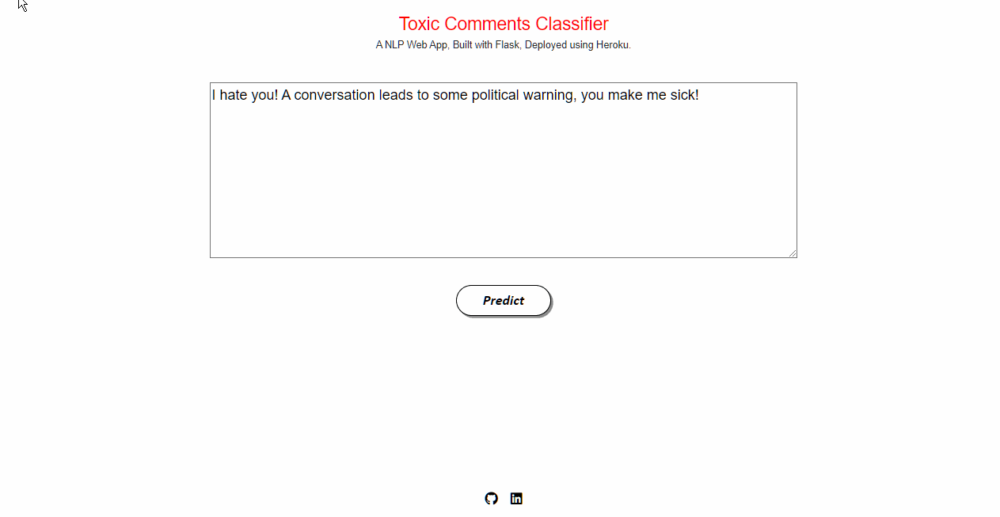

# Toxic-Comment-Classifier

[](https://www.kaggle.com/competitions/jigsaw-toxic-comment-classification-challenge/data) 

### Problem statement:
A DL project that helps in classifying Toxic Comment weather it is positive or not.

### Dataset
You can find the dataset [here.](https://www.kaggle.com/competitions/jigsaw-toxic-comment-classification-challenge/data)

## setup
To create a project from scratch use following steps - -

- Clone the repository : https://github.com/ni3choudhary/Toxic-Comment-Classifier.git
- Inside the project root directory, Create Python Virtual Environment using below command.
```console
$ python3 -m venv venv
``` 

Activate Virtual Environment
```console
$ .venv/bin/activate 
          OR
$ .\venv\Scripts\activate
```
Install Libraries using below command
```console
$ pip install -r requirements.txt
```
- Run jupyter notebook to get the model and labels pickle file.

- Copy both pickle files and paste inside **flask** directory .

- Inside the **flask** directory run **app.py** on terminal to start local server.
```console
$ python app.py
```
## App Demo



• Please do ⭐ the repository, if it helped you in anyway.

